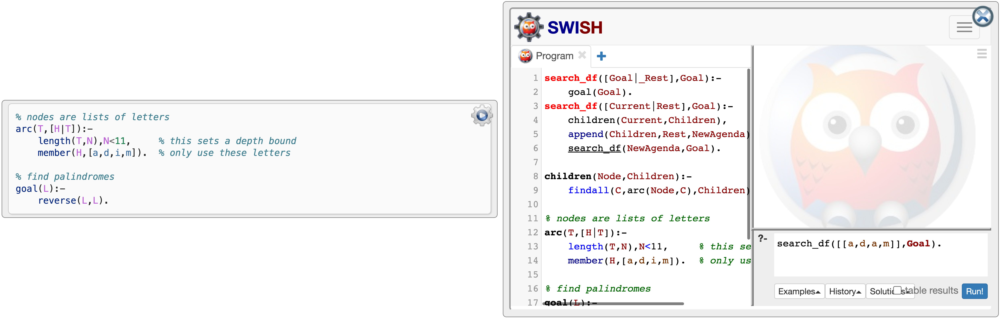

# Summary #

"Simply Logical -- Intelligent Reasoning by Example" by Peter Flach was first
published by John Wiley in 1994 [@flach1994simply].
It could be purchased as book-only or with a 3.5 inch diskette containing the
SWI-Prolog [@wielemaker2012swiprolog] programmes printed in the book
(for various operating systems).
In 2007 the copyright reverted back to the author at which point the book and
programmes were made freely available online;
the print version is no longer distributed through John Wiley publishers.
In 2015, as a pilot, we ported most of the original book into an online,
interactive website using SWI-Prolog's SWISH platform [@wielemaker2015swish].
Since then, we launched the *Simply Logical* open source
organisation^[https://simply-logical.space/] committed to maintaining
a suite of freely available interactive online educational
resources^[https://github.com/simply-logical/] about
Artificial Intelligence and Logic Programming with Prolog.
With the advent of new educational technologies we were inspired to rebuild
the book from the ground up using the Jupyter Book platform [@jupyter2020book]
enhanced with a collection of bespoke plugins that implement, among other
things, interactive SWI-Prolog code blocks that can be executed directly in
a web browser.
This new version is more modular, easier to maintain, and possible to split
into custom teaching modules, in addition to being modern-looking, visually
appealing, and compatible with a range of (mobile) devices of varying screen
sizes.

# Artificial Intelligence and Logic Programming with Prolog #

The book discusses methods to implement intelligent reasoning by means of
Prolog programmes.
It is written from the shared viewpoints of *Computational Logic* -- which
strives to automate various kinds of reasoning -- and
*Artificial Intelligence* -- which seeks to implement aspects of intelligent
behaviour as computation.
The combination of these two perspectives distinguishes this book from among
its peers and offers a unique learning experience.
The readers working in Artificial Intelligence will find a detailed treatment of
how the power of logic can be harnessed to solve some of the (practical)
problems they may be facing.
To support this learning objective the book provides a variety of interactive
code examples in the domains of natural language interpretation,
abductive and inductive reasoning, and reasoning by default.
Those acquainted with Logic Programming, on the other hand, will be interested
in the practical side of many topics that in other educational materials
mostly receive theoretical treatment -- many advanced programmes presented and
explained in this book are not, in a didactic form, available elsewhere.
The readers unfamiliar with either field will benefit from a comprehensive
learning resource that collects diverse subjects and presents them consistently
across accessible and engaging modules.
This approach offers the best of both worlds: it introduces the theory of
Logic Programming that does not intimidate novices to the field with superfluous
mathematical machinery, nonetheless it offers strong theoretical foundations
for the practical aspects of programming for Artificial Intelligence.

The book consists of three parts.
Part I deals with Logic and Logic Programming and covers:

* main concepts in Logic Programming, such as programme clauses,
  query answering, proof trees, and recursive data structures (Chapter 1);
* rigorous discussion of resolution theorem proving in clausal logic,
  stepping through propositional clausal logic, relational clausal logic
  (without functors), full clausal logic, and definite clause logic,
  on the way dealing with concepts such as Herbrand models and resolution
  refutations, as well as meta-theoretical notions like soundness and
  completeness (Chapter 2); and
* practical aspects of Prolog programming, including SLD-trees, cuts,
  arithmetic expressions, second-order predicates (e.g., `setof`),
  various programming techniques (e.g., accumulators and difference lists)
  as well as a general programming methodology and meta-interpreters
  (Chapter 3).

Part II shifts the focus from the Logic Programming perspective to the
Artificial Intelligence viewpoint, predominantly dealing with graphs and
search.
Chapter 4 discusses graphs found naturally in Prolog: in form of trees
represented by terms (e.g., parse trees) and as search spaces spanned by
predicates (e.g., SLD-trees).
Next, Chapter 5 overviews depth-first search, iterative deepening, and
breadth-first search in the context of Logic Programming;
moreover, it develops a breadth-first Prolog meta-interpreter and an
(inefficient) interpreter for full clausal logic, in addition to illustrating
forward chaining with a programme that generates Herbrand models of a set of
clauses.
Chapter 6 discusses best-first search and its optimality, leading to
the A$^\star$ algorithm and a brief discussion of non-exhaustive heuristic
search strategies (beam search and hill-climbing).
Finally, Part III encompasses advanced topics.
Chapter 7 covers natural language parsing and interpretation, touching upon
context-free grammar as well as definite clause resolution and grammar.
Chapter 8 discusses reasoning with incomplete information in view of the Closed
World Assumption and Predicate Completion.
Specifically, it introduces abductive reasoning as well as default reasoning by
means of negation as failure and defeasible default rules.
Then, Chapter 9 deals with inductively inferring a logic programme from
examples, introducing and implementing concepts such as generality between
clauses and anti-unification, which are fundamental to Inductive Logic
Programming.
(Appendices offer answers to selected exercises, an overview of built-in
predicates in Prolog, a library of utility predicates underpinning many
programmes introduced throughout the book, and listings of two larger
programmes for transforming a Predicate Logic formula to clausal logic and
performing Predicate Completion.)

As suggested by the title, this book presents intelligent reasoning techniques
by example, therefore every method is accompanied by a Prolog implementation
that, in the online edition, can be executed directly in a web browser.
These code listings serve two didactic purposes: they engender understanding
through hands-on experience, but more importantly the declarative reading of
each implementation constitutes an integral part of the explanation of the
underlying technique.
The more elaborate programmes are carefully designed to explicitly communicate
the steps taken to achieve the goal, explaining key issues along the way.
The book therefore does not just focus on "How is this done in Prolog?",
but rather on "How should I solve this problem, were I to start from scratch?"
In other words, it embodies the "teaching by showing, learning by doing"
philosophy.
Despite the strong focus on practical examples, a substantial portion of
the book is devoted to the theoretical underpinnings of clausal logic and
Logic Programming, however their presentation is primarily motivated by
their instrumental role in understanding and implementing each particular
technique.^[
The book's preface offers a more comprehensive explanation of its
instructional design and content:
<https://book.simply-logical.space/src/simply-logical.html#author-s-preface>.]

The book has been the foundation of multiple courses taught to undergraduate
and master's students at the University of Bristol and elsewhere, e.g.,
King's College London, Queen Mary University of London, University of Cardiff,
University College Cork, Tufts University, St. Joseph's University,
University of Freiburg, Uppsala University, Free University Brussels, and
University of Sevilla^[http://people.cs.bris.ac.uk/~flach/SL/Courses.html].
Specifically, the *Artificial Intelligence with Logic Programming* undergraduate
course^[https://coms30106.github.io/] offered at the University of Bristol
follows the book quite closely;
a collection of slides whose structure mirrors the presentation of material in
the book is freely available as a supplementary educational
resource^[https://github.com/simply-logical/slides/].
A spiritual successor of this unit is
*Computational Logic for Artificial Intelligence* now taught as part of the
curriculum delivered by the Interactive Artificial Intelligence Centre for
Doctoral Training^[https://www.bristol.ac.uk/cdt/interactive-ai/] (IAI CDT).
This unit takes a more modern approach by discussing the interconnections
between logic programming (with SWI-Prolog) and recent developments in
data-driven machine
learning^[https://github.com/simply-logical/ComputationalLogic/].

{width=95%}

# Statement of Need #

This online book offers an intuitive and comprehensive introduction to
*Artificial Intelligence and Logic Programming* in the form of an accessible
educational resource with a modern feel and look.
The learning experience is enhanced with *exercises* and
*practical coding examples*;
the latter are delivered through interactive code boxes that can be executed
directly in a web browser, thus fulfilling the original vision for the
paperback edition that was curtailed by the lack of appropriate technologies at
the time of its publication.
It is written with three kinds of readers in mind:
*Artificial Intelligence* researchers or practitioners;
*Logic Programming* researchers or practitioners; and
students (advanced undergraduate or graduate level) in both fields.
The book can be used as a teaching aid, but it is also suitable for self-study.
It can be adopted as is or the content can be rearranged into a bespoke learning
resource, which is made possible by the modular design of the book source
that is split into a collection of files based on their type:

* text is written in Markdown -- each sub-section is placed in a separate file;
* code is released as SWI-Prolog scripts; and
* figures are available as Scalable Vector Graphics (SVG).

All of these are published on
GitHub^[https://github.com/simply-logical/simply-logical/], which allows to
easily reuse these materials, incorporate them into bespoke courses, or
adapt them into alternative educational resources such as practical
training sessions.

From a technical perspective, the development of the online edition required
us to implement a collection of Jupyter Book plugins (that also work with
Sphinx) spanning functionality specific to
SWI-Prolog^[https://www.swi-prolog.org/] [@wielemaker2012swiprolog],
later extended to be compatible with the cplint^[https://cplint.ml.unife.it/]
[@riguzzi2018foundations] and ProbLog^[https://dtai.cs.kuleuven.be/problog/]
[@deraedt2007problog] programming languages.
Specifically, we released
`sphinx-prolog`^[https://github.com/simply-logical/sphinx-prolog/], which
allows to embed interactive SWI-Prolog and cplint code boxes -- see Figure 1 --
by including their source directly in a Markdown file via a custom Prolog code
listing or load the programme from an external code file.
This plugin is based on SWISH^[https://swish.swi-prolog.org/] --
SWI-Prolog for Sharing -- which is an online, interactive SWI-Prolog coding
environment akin to Jupyter Notebooks [@wielemaker2015swish].
The `sphinx-problog`^[https://github.com/simply-logical/sphinx-problog/]
extension, on the other hand, allows to embed interactive ProbLog code boxes,
the implementation of which is based on the online execution environment
underpinning the code examples published as part of the ProbLog website.
Additionally, building these plugins prompted us to explore alternative
technologies for composing (interactive) training resources, which in turn has
inspired a prototype of a new publishing workflow in which multiple artefacts
such as online documents, slides, and computational notebooks can be generated
from a unified collection of source materials [@sokol2021you].

# Acknowledgements #

The development of `sphinx-prolog` and `sphinx-problog` Jupyter Book plugins
was supported by the TAILOR Network -- an ICT-48 European AI Research
Excellence Centre funded by EU Horizon 2020 research and innovation programme,
grant agreement number 952215.

# References #
